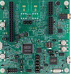

.. _evkmimxrt1010:

EVK-MIMXRT1010
####################

Overview
********

The NXP MIMXRT1010-EVK is a development board for the i.MX MIMXRT1011 500 MHz 32-bit ARM® Cortex®-M7 MCUs.

MCU device and part on board is shown below:

 - Device: MIMXRT1011
 - PartNumber: MIMXRT1011DAE5A

