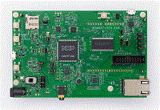

.. _evkmimxrt1020:

EVK-MIMXRT1020
####################

Overview
********

The NXP MIMXRT1020-EVK is a development board for the i.MX MIMXRT1021 500 MHz 32-bit ARM® Cortex®-M7 MCUs.

MCU device and part on board is shown below:

 - Device: MIMXRT1021
 - PartNumber: MIMXRT1021DAG5A

