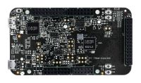

.. _frdmk32l3a6:

FRDM-K32L3A6
####################

Overview
********

The NXP FRDM-K32L3A6 is a development board for the Kinetis K32L3A60 72 MHz 32-bit ARM® Cortex®-M4 and ARM® Cortex®-M0P MCUs


MCU device and part on board is shown below:

 - Device: K32L3A60
 - PartNumber: K32L3A60VPJ1A

