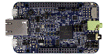

.. _frdmk66f:

FRDM-K66F
####################

Overview
********

The FRDM-K66F is a low cost development platform for Kinetis K66, K65, and K26 MCUs.Audio features such as audio codec, digital MEMS microphone, auxiliary audio input jack, headset/analog microphone jack and two inputs for additional analog microphones.Peripherals enable rapid prototyping, including a 6-axis digital accelerometer and magnetometer to create full eCompass capabilities, dual role high-speed USB interface with Micro-B USB connector, a microSD card slot, and connectivity using onboard Ethernet port and headers for use with Bluetooth® and 2.4 GHz radio add-on modules.OpenSDA v2.1, the NXP open source hardware embedded serial and debug adapter running an open source bootloader, offers options for serial communication, flash programming, and run-control debugging.


MCU device and part on board is shown below:

 - Device: MK66F18
 - PartNumber: MK66FN2M0VMD18

