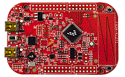

.. _frdmkl27z:

FRDM-KL27Z
####################

Overview
********

The FRDM-KL27Z is an ultra-low-cost development platform for the Kinetis® L Series KL17 and KL27 MCUs built on the ARM® Cortex®-M0+ processor.Features include easy access to MCU I/O, battery-ready, low-power operation, a standard-based form factor with expansion board options and a built-in debug interface for flash programming and run-control.The FRDM-KL27Z is supported by a range of NXP® and third-party development software.

MCU device and part on board is shown below:

 - Device: MKL27Z644
 - PartNumber: MKL27Z64VLH4

