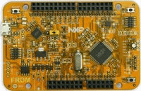

.. _frdmkv11z:

FRDM-KV11Z
####################

Overview
********

FRDM-KV11Z is a development platform for the Kinetis V series KV1x 64 KB and 128 KB MCU family built on the ARM® Cortex®-M0+ processor.

MCU device and part on board is shown below:

 - Device: MKV11Z7
 - PartNumber: MKV11Z128VLH7

