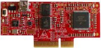

.. _hvpkv31f120m:

HVP-KV31F120M
####################

Overview
********

The HVP-KV31F120M controller card is a development platform for the Kinetis.KV31 family that, in combination with the HVP-MC3PH high-voltage development platform, provides ready-made software and hardware development for.high-voltage motor control and power conversion applications.

MCU device and part on board is shown below:

 - Device: MKV31F51212
 - PartNumber: MKV31F512VLL12

