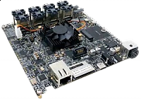

.. _mekmimx8qm:

MEK-MIMX8QM
####################

Overview
********

The i.MX 8QuadMax Multisensory Enablement Kit (MEK) is an evaluation platform for the i.MX 8QuadMax Application Processor. Hardware defign files, software tools and board support packages(BSPs) for Linux Android, and FreeRTOS are availabe for customers to use as a reference for starting design of their products.

MCU device and part on board is shown below:

 - Device: MIMX8QM6
 - PartNumber: MIMX8QM6AVUFF

