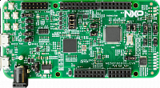

.. _mc56f80000evk:

MC56F80000-EVK
####################

Overview
********

The MC56F80000-EVK is an ultra-low-cost development platform for Digital Signal Controller MC56F80xxx MCU.

 - Form-factor compatible with the Arduino R3 pin layout.
 - On board debugger(multilink) circuit enabling debugging and programming with CodeWarrior, it also enable a virtual series port.
 - Peripherals enable rapid prototyping, including a 3-axis MEMS accelerometer, 6 PWM and 3 user LEDs, 4 user push buttons for direct interaction, two OPAMP external feedback circuits, a SPI interfaced Flash memory and 3 resistor dividers for ADC test.

MCU device and part on board is shown below:

 - Device: MC56F80748
 - PartNumber: MC56F80748VLH

Getting Started with MCUXpresso SDK Package
*******************************************
.. toctree::
   :maxdepth: 1

   gettingStarted/gsindex.md

Getting Started with MCUXpresso SDK GitHub
*******************************************
.. toctree::
   :maxdepth: 1

   /gsd/repo.rst

Release Notes
*******************************************
.. toctree::
   :maxdepth: 1

   releaseNotes/rnindex.md

ChangeLog
*******************************************
.. toctree::
   :maxdepth: 1

   changeLog/clindex.md
