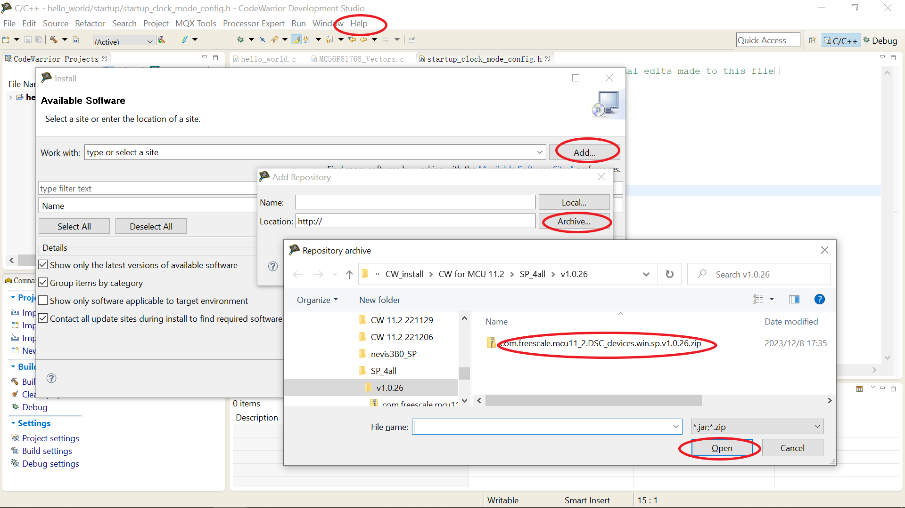

# Run a demo application using CodeWarrior

This section describes the steps required to build, run, and debug example applications provided in the MCUXpresso SDK.

**Note:** CodeWarrior for DSC v11.2 is used as an example to show below steps, and the DSC toolchain should correspond to the latest supported version, as described in *MCUXpresso SDK Release Notes for MC56F81000-EVK* \(document MCUXSDKMC56F81000RN\).

1.  Download CodeWarrior for DSC v11.2, and ServicePack1 for DSC devices from [CodeWarrior for 56800 Digital Signal Controller v11.2](https://www.nxp.com/design/design-center/software/development-software/codewarrior-development-tools/codewarrior-legacy/codewarrior-for-56800-digital-signal-controller-v11-2:CW-DSC).
2.  Install CodeWarrior for DSC v11.2.
3.  Install ServicePack1 within CodeWarrior from the menu.

    Click the **Help** menu and select **Install new software** \> **Add** \> **Archive**. Select the SP on your computer, check **MCU v11.2 DSC Service Packs**, and click **Next**.

    


```{include} ../topics/build_an_example_application.md
:heading-offset: 1
```

```{include} ../topics/run_an_example_application.md
:heading-offset: 1
```

