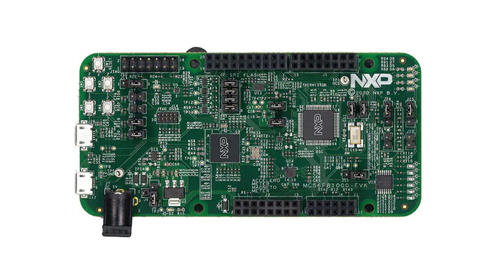

.. _mc56f81000evk:

MC56F81000-EVK
####################

Overview
********

The MC56F81000-EVK is an ultra-low-cost development platform for digital signal controller MC56F81xxx MCU.

 - The kit is form-factor compatible with the Arduino™ R3 pin layout and features ROM bootloader supporting SCI and LPIIC.
 - The MC56F81000-EVK features onboard debugger(multilink) circuit enabling debugging and programming with CodeWarrior.
 - Peripherals enable rapid prototyping, including a 6-axis digital accelerometer and magnetometer to create full eCompass capabilities, 6 buffered LEDs including PWM signals, 4 user LEDs, 4 user push_buttons for direct interaction, two OPAMP external feedback circuits, an SPI interfaced Flash memory and a USB to UART bridge circuit.

MCU device and part on board is shown below:

 - Device: MC56F81768
 - PartNumber: MC56F81768LVLH

Getting Started
****************
.. toctree::
   :maxdepth: 1
   :caption: Getting Started with MCUXpresso SDK for MC56F81000-EVK

   gettingStarted/gsindex.md

Release Notes
****************
.. toctree::
   :maxdepth: 1
   :caption: MCUXpresso SDK Release Notes for MC56F81000-EVK

   releaseNotes/rnindex.md
