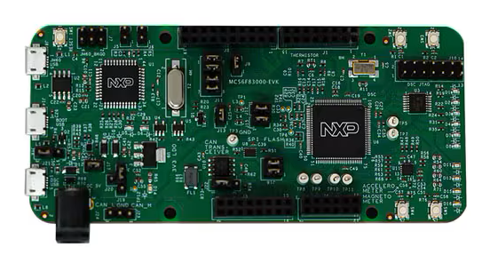

.. _mc56f83000evk:

MC56F83000-EVK
####################

Overview
********

The MC56F83000-EVK is an ultra-low-cost development platform for digital signal controller MC56F83xxx MCU.

 - The kit is form-factor compatible with the Arduino™ R3 pin layout and features ROM bootloader supporting SCI, IIC and CAN.
 - Peripherals enable rapid prototyping, including a 6-axis digital accelerometer and magnetometer to create full eCompass capabilities, 6 buffered LEDs indicating PWM signals, 4 user LEDs, 4 user push-buttons for direct interaction, an SPI interfaced Flash memory, a high speed CAN transceiver circuit, a USBOTG connector and a USB to UART bridge circuit.
 - The MC56F83000-EVK features onboard debugger OSJTAG circuit enabling debugging and programming with CodeWarrior.

MCU device and part on board is shown below:

 - Device: MC56F83789
 - PartNumber: MC56F83789VLL

Getting Started with MCUXpresso SDK Package
*******************************************
.. toctree::
   :maxdepth: 1

   gettingStarted/gsindex.md

Getting Started with MCUXpresso SDK GitHub
*******************************************
.. toctree::
   :maxdepth: 1

   /gsd/repo.rst

Release Notes
*******************************************
.. toctree::
   :maxdepth: 1

   releaseNotes/rnindex.md

ChangeLog
*******************************************
.. toctree::
   :maxdepth: 1

   changeLog/clindex.md
