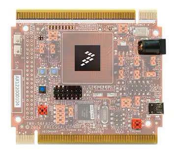

.. _twrmc56f8200:

TWR-MC56F8200
####################

Overview
********

The TWR-MC56F8200 is a standalone development board ideal for motor and digital power control applications.

 - It can be used in conjunction with the Tower® System peripheral boards, including the LV3PH motor control kit (TWR-MC-LV3PH module).
 - The board includes the NXP MC56F82748 DSC preloaded with an application demonstrating the ADC and an FIR filter application that will sense heat at the four corners of the module.
 - Other demo applications and complete instructions and software on how to turn a 3-phase BLDC motor using the LV3PH motor control kit are available

MCU device and part on board is shown below:

 - Device: MC56F82748
 - PartNumber: MC56F82748VLH

Getting Started with MCUXpresso SDK Package
*******************************************
.. toctree::
   :maxdepth: 1

   gettingStarted/gsindex.md

Getting Started with MCUXpresso SDK GitHub
*******************************************
.. toctree::
   :maxdepth: 1

   ../../../gsd/repo.rst

Release Notes
*******************************************
.. toctree::
   :maxdepth: 1

   releaseNotes/rnindex.md
