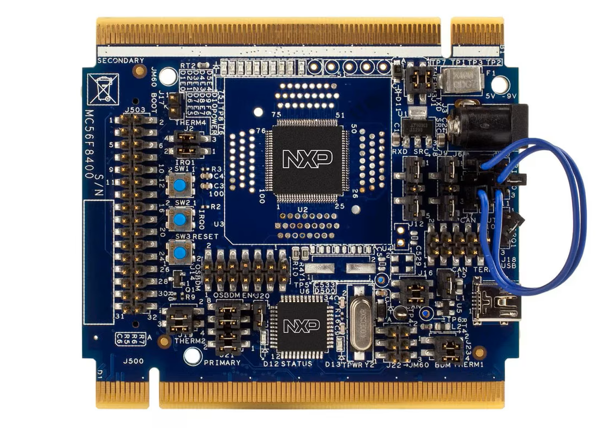

.. _twrmc56f8400:

TWR-MC56F8400
####################

Overview
********

The TWR-MC56F8400 is a standalone development board ideally suited for Motor and Digital Power control applications.

 - It can be used in conjunction with the Tower® System peripheral boards, including the LV3PH motor control kit TWR-MC-LV3PH module.
 - The MC56F84789 included on the board comes pre-loaded with an application demonstrating the ADC with an FIR filter application.
 - The module features serial I/O over USB, CAN circuits and access to each pin.
 - All signals are also available on the headers for easy and neat coupling to your project.
 - It can also be used as the main control board with an APMOTOR56F8000E motor control board.

MCU device and part on board is shown below:

 - Device: MC56F84789
 - PartNumber: MC56F84789VLL

Getting Started
****************
.. toctree::
   :maxdepth: 1
   :caption: Getting Started with MCUXpresso SDK for TWR-MC56F8400

   gettingStarted/gsindex.md

Release Notes
****************
.. toctree::
   :maxdepth: 1
   :caption: MCUXpresso SDK Release Notes for TWR-MC56F8400

   releaseNotes/rnindex.md
