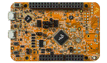

.. _frdmk22f:

FRDM-K22F
####################

Overview
********

Form-factor compatible with the Arduino R3 pin layout.Peripherals enable rapid prototyping, including a 6-axis digital accelerometer and magnetometer to create full eCompass capabilities, a tri-colored LED and 2 user push-buttons for direct interaction, and connectivity for use with Bluetooth and 2.4 GHz radio add-on modules.OpenSDAv2 offers options for serial communication, flash programming, and run-control debugging.The FRDM-K22F is enabled with the ARM mbed development platform, which means you can quickly get started designing with no downloads or installations.

MCU device and part on board is shown below:

 - Device: MK22F51212
 - PartNumber: MK22FN512VLH12

Getting Started with MCUXpresso SDK Package
*******************************************
.. toctree::
   :maxdepth: 1

   ../../../gsd/package.rst

Getting Started with MCUXpresso SDK GitHub
*******************************************
.. toctree::
   :maxdepth: 1

   ../../../gsd/repo.rst

Release Notes
*******************************************
.. toctree::
   :maxdepth: 1

   releaseNotes/rnindex.md

ChangeLog
*******************************************
.. toctree::
   :maxdepth: 1

   changeLog/clindex.md

Driver API Reference Manual
****************************

This section provides a link to the Driver API RM, detailing available drivers and their usage to help you integrate hardware efficiently.

:ref:`MK22F51212_drivers`

Middleware Documentation
*****************************

Find links to detailed middleware documentation for key components. While not all onboard middleware is covered, this serves as a useful reference for configuration and development.

Multicore
=========

:ref:`multicore`

FreeMASTER
==========

.. toctree::
   :maxdepth: 1

   ../../../middleware/freemaster/doc/index.md

FreeRTOS
========

:ref:`freertos`

File systemFatfs
================

:ref:`fatfs`
