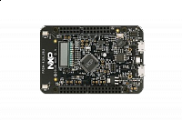

.. _frdmk32l2b:

FRDM-K32L2B
####################

Overview
********

The FRDM-K32L2B3 is supported by a range of NXP and third-party development software.

MCU device and part on board is shown below:

 - Device: K32L2B31A
 - PartNumber: K32L2B31VLH0A

Getting Started
****************
.. toctree::
   :maxdepth: 1
   :caption: Getting Started with MCUXpresso SDK for FRDM-K32L2B

   ../../../gsd/package.rst

Release Notes
****************
.. toctree::
   :maxdepth: 1
   :caption: MCUXpresso SDK Release Notes for FRDM-K32L2B

   releaseNotes/rnindex.md
