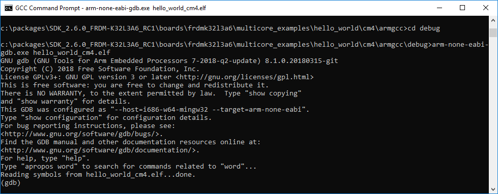
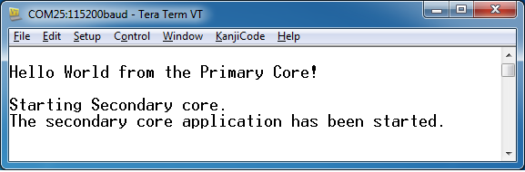

# Run a multicore example application

When running a multicore application, the same prerequisites about J-Link/J-Link OpenSDA firmware and the serial console as for the single core application applies, as described in *[Run an example application](run_an_example_application_003.md#)*.

The secondary core binary is linked into primary core \*.elf file, when downloading the primary core \*.elf file, the secondary core binary will be downloaded too. To run the application, open a GCC Arm Embedded tool chain command window \(used for building the application\) and change to the directory that contains the example application output \(debug or release subdirectories\). Run the command `arm-none-eabi-gdb.exe <application_name>.elf`. For the multicore Hello World example, it is `arm-none-eabi-gdb.exe hello_world_cm4.elf`.



Run these commands:

1.  ```
target remote localhost:2331
```

2.  ```
monitor reset
```

3.  ```
monitor halt
```

4.  ```
load
```


The application is now downloaded and halted at the reset vector. Execute the **monitor go** command to start the example application. The multicore Hello World application is now running and a banner is displayed on the terminal. Because of the target device default boot source order, the application log can be delayed for a while. To close the debug session, execute the **quit** or just **q** command




**Parent topic:**[Run a demo using Arm® GCC](../topics/run_a_demo_using_arm__gcc.md)

