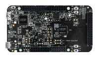

:pdf-download: ../../../_assets/boards/frdmk32l3a6/mcuxsdk-frdmk32l3a6.pdf
.. _frdmk32l3a6:

FRDM-K32L3A6
####################

Overview
********

The NXP FRDM-K32L3A6 is a development board for the Kinetis K32L3A60 72 MHz 32-bit ARM Cortex-M4 and ARM Cortex-M0P MCUs

MCU device and part on board is shown below:

 - Device: K32L3A60
 - PartNumber: K32L3A60VPJ1A

Getting Started with MCUXpresso SDK Package
*******************************************
.. toctree::
   :maxdepth: 1

   ../../../gsd/package.rst

Getting Started with MCUXpresso SDK GitHub
*******************************************
.. toctree::
   :maxdepth: 1

   ../../../gsd/repo.rst

Release Notes
*******************************************
.. toctree::
   :maxdepth: 1

   releaseNotes/rnindex.md

ChangeLog
*******************************************
.. toctree::
   :maxdepth: 1

   changeLog/clindex.md

Driver API Reference Manual
****************************

This section provides a link to the Driver API RM, detailing available drivers and their usage to help you integrate hardware efficiently.

:ref:`K32L3A60_drivers`

Middleware Documentation
*****************************

Find links to detailed middleware documentation for key components. While not all onboard middleware is covered, this serves as a useful reference for configuration and development.

Multicore
=========

:ref:`multicore`

FreeMASTER
==========

.. toctree::
   :maxdepth: 1

   ../../../middleware/freemaster/doc/index.md

FreeRTOS
========

:ref:`freertos`

File systemFatfs
================

:ref:`fatfs`
