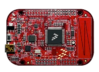

.. _frdmke02z40m:

FRDM-KE02Z40M
####################

Overview
********

The Freedom-KE02Z40M is an ultra-low-cost development platform for Kinetis KE02 MCUs

MCU device and part on board is shown below:

 - Device: MKE02Z4
 - PartNumber: MKE02Z64VQH4

Getting Started with MCUXpresso SDK Package
*******************************************
.. toctree::
   :maxdepth: 1

   ../../../gsd/package.rst

Getting Started with MCUXpresso SDK GitHub
*******************************************
.. toctree::
   :maxdepth: 1

   ../../../gsd/repo.rst

Release Notes
*******************************************
.. toctree::
   :maxdepth: 1

   releaseNotes/rnindex.md

ChangeLog
*******************************************
.. toctree::
   :maxdepth: 1

   changeLog/clindex.md

Driver API Reference Manual
****************************

This section provides a link to the Driver API RM, detailing available drivers and their usage to help you integrate hardware efficiently.

:ref:`MKE02Z4_drivers`

Middleware Documentation
*****************************

Find links to detailed middleware documentation for key components. While not all onboard middleware is covered, this serves as a useful reference for configuration and development.

FreeMASTER
==========

.. toctree::
   :maxdepth: 1

   ../../../middleware/freemaster/doc/index.md

