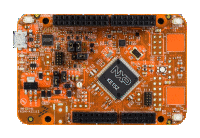

.. _frdmke15z:

FRDM-KE15Z
####################

Overview
********

The FRDM-KE15Z Freedom Board is designed to work in standalone mode or as the main board of FRDM-TOUCH, FRDM-MC-LVBLDC, and Arduino boards. This Freedom board is compatible with DC 5v and 3.3v power supply, and features a KL15Z, a device boasting up to 256KB Flash and 32KB SRAM and numerous analog and digital peripherals. The on-board interfaces include an RGB LED, a 6-axis digital sensor, a 3-axis digital angular rate gyroscope, an ambient light sensor, and a capacitive touch slider.

MCU device and part on board is shown below:

 - Device: MKE15Z7
 - PartNumber: MKE15Z256VLL7

Getting Started
****************
.. toctree::
   :maxdepth: 1
   :caption: Getting Started with MCUXpresso SDK for FRDM-KE15Z

   ../../commongs/gettingStarted/gsindex.md

Release Notes
****************
:doc:`MCUXpresso SDK Release Notes for FRDM-KE15Z <../../../release/index>`
