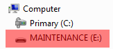

# Updating OpenSDA firmware

Any NXP hardware platform that comes with an OpenSDA-compatible debug interface has the ability to update the OpenSDA firmware. This typically means switching from the default application \(either CMSIS-DAP/mbed/DAPLink or P&E Micro\) to a SEGGER J-Link. This section contains the steps to switch the OpenSDA firmware to a J-Link interface. However, the steps can be applied to restoring the original image also. For reference, OpenSDA firmware files can be found at the links below:

-   J-Link: Download appropriate image from [www.segger.com/opensda.html](http://www.segger.com/opensda.html). Choose the appropriate J-Link binary based on the table in [Default debug interfaces](default_debug_interfaces.md). Any OpenSDA v1.0 interface should use the standard OpenSDA download \(in other words, the one with no version\). For OpenSDA 2.0 or 2.1, select the corresponding binary.
-   CMSIS-DAP/mbed/DAPLink: DAPLink OpenSDA firmware is available at [www.nxp.com/opensda](http://www.nxp.com/opensda).
-   P&E Micro: Downloading P&E Micro OpenSDA firmware images requires registration with P&E Micro \([www.pemicro.com](http://www.pemicro.com/opensda/index.cfm)\).

Perform the following steps to update the OpenSDA firmware on your board for Windows and Linux OS users:

1.  Unplug the board's USB cable.
2.  Press the **Reset** button on the board. While still holding the button, plug the USB cable back into the board.
3.  When the board re-enumerates, it shows up as a disk drive called **MAINTENANCE**.

    

4.  Drag and drop the new firmware image onto the MAINTENANCE drive.

    **Note:** If for any reason the firmware update fails, the board can always re-enter maintenance mode by holding down **Reset** button and power cycling.


These steps show how to update the OpenSDA firmware on your board for Mac OS users.

1.  Unplug the board's USB cable.
2.  Press the **Reset** button of the board. While still holding the button, plug the USB cable back into the board.
3.  For boards with OpenSDA v2.0 or v2.1, it shows up as a disk drive called **BOOTLOADER** in **Finder**. Boards with OpenSDA v1.0 may or may not show up depending on the bootloader version. If you see the drive in **Finder**, proceed to the next step. If you do not see the drive in Finder, use a PC with Windows OS 7 or an earlier version to either update the OpenSDA firmware, or update the OpenSDA bootloader to version 1.11 or later. The bootloader update instructions and image can be obtained from P&E Microcomputer website.
4.  For OpenSDA v2.1 and OpenSDA v1.0 \(with bootloader 1.11 or later\) users, drag the new firmware image onto the BOOTLOADER drive in **Finder**.
5.  For OpenSDA v2.0 users, type these commands in a Terminal window:

    ```
    > sudo mount -u -w -o sync /Volumes/BOOTLOADER
    > cp -X  <path to update file> /Volumes/BOOTLOADER
    ```

    **Note:** If for any reason the firmware update fails, the board can always re-enter bootloader mode by holding down the **Reset** button and power cycling.


**Parent topic:**[Updating debugger firmware](../topics/updating_debugger_firmware.md)

