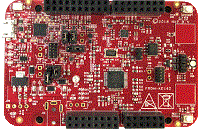

.. _frdmke16z:

FRDM-KE16Z
####################

Overview
********

The FRDM-KE16Z Freedom Board is designed to work in standalone mode or as the main board of FRDM-TOUCH, FRDM-MC-LVBLDC, and Arduino boards. This Freedom board is compatible with DC 5v and 3.3v power supply, and features a KE16Z, a device boasting up to 64KB Flash and 8KB SRAM and numerous analog and digital peripherals. The on-board interfaces include an RGB LED, a 6-axis digital sensor, a 3-axis digital angular rate gyroscope, an ambient light sensor, CAN transceiver and two capacitive touch pads....

MCU device and part on board is shown below:

 - Device: MKE16Z4
 - PartNumber: MKE16Z64VLF4

Getting Started
****************
.. toctree::
   :maxdepth: 1
   :caption: Getting Started with MCUXpresso SDK for FRDM-KE16Z

   gettingStarted/gsindex.md
Release Notes
****************
:doc:`MCUXpresso SDK Release Notes for FRDM-KE16Z <../../../release/index>`
