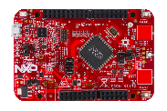

.. _frdmke17z:

FRDM-KE17Z
####################

Overview
********

The FRDM-KE17Z Freedom Board is designed to work in standalone mode or as the main board of FRDM-TOUCH, FRDM-MC-LVBLDC, and Arduino boards. This Freedom board is compatible with DC 5v and 3.3v power supply and features a KE17Z, a device boasting up to 256KB Flash and 48KB SRAM, and numerous analog and digital peripherals.The onboard interfaces include an RGB LED, a 6-axis digital sensor, a 3-axis digital angular rate gyroscope, an ambient temperature sensor, and two capacitive touch pads.

MCU device and part on board is shown below:

 - Device: MKE17Z7
 - PartNumber: MKE17Z256VLL7

Getting Started with MCUXpresso SDK Package
*******************************************
.. toctree::
   :maxdepth: 1

   gettingStarted/gsindex.md

Getting Started with MCUXpresso SDK GitHub
*******************************************
.. toctree::
   :maxdepth: 1

   ../../../gsd/repo.rst

Release Notes
*******************************************
.. toctree::
   :maxdepth: 1

   releaseNotes/rnindex.md

ChangeLog
*******************************************
.. toctree::
   :maxdepth: 1

   changeLog/clindex.md

Driver API Reference Manual
****************************

This section provides a link to the Driver API RM, detailing available drivers and their usage to help you integrate hardware efficiently.

:ref:`MKE17Z7_drivers`

Middleware Documentation
*****************************

Find links to detailed middleware documentation for key components. While not all onboard middleware is covered, this serves as a useful reference for configuration and development.

FreeMASTER
==========

.. toctree::
   :maxdepth: 1

   ../../../middleware/freemaster/doc/index.md

FreeRTOS
========

:ref:`freertos`
