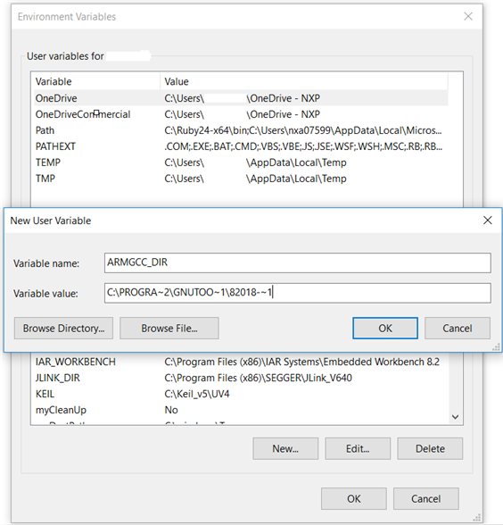

# Add a new system environment variable for ARMGCC\_DIR 

Create a new *system* environment variable and name it as `ARMGCC_DIR`. The value of this variable should point to the Arm GCC Embedded tool chain installation path. For this example, the path is:

*C:\\Program Files \(x86\)\\GNU Tools Arm Embedded\\8 2018-q4-major*

See the installation folder of the GNU Arm GCC Embedded tools for the exact path name of your installation.

Use a short path for path settings. To convert the path to a short path, run the `for %I in (.) do echo %~sI` command in above path.

**Parent topic:**[Set up toolchain](../topics/armgcc_set_up_toolchain.md)

