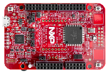

.. _frdmke17z512:

FRDM-KE17Z512
####################

Overview
********

| he FRDM-KE17Z512 Freedom Board is designed to work in standalone mode or as the main board of FRDM-TOUCH, FRDM-MC-LVBLDC, and Arduino boards. This Freedom board is compatible with DC 5v and 3.3v power supply and features a KE17Z, a device boasting up to 512KB Flash and 96KB SRAM, and numerous analog and digital peripherals.The onboard interfaces include an RGB LED, a 6-axis digital sensor, a 3-axis digital angular rate gyroscope, an ambient temperature sensor, and two capacitive touch pads.

MCU device and part on board is shown below:

 - Device: MKE17Z9
 - PartNumber: MKE17Z512VLL9

Getting Started with MCUXpresso SDK Package
*******************************************
.. toctree::
   :maxdepth: 1

   gettingStarted/gsindex.md

Getting Started with MCUXpresso SDK GitHub
*******************************************
.. toctree::
   :maxdepth: 1

   ../../../gsd/repo.rst

Release Notes
*******************************************
.. toctree::
   :maxdepth: 1

   releaseNotes/rnindex.md

ChangeLog
*******************************************
.. toctree::
   :maxdepth: 1

   changeLog/clindex.md
