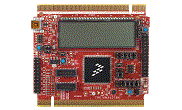

.. _twrkm34z75m:

TWR-KM34Z75M
####################

Overview
********

The TWR-KM34Z75M board is designed to work either in standalone mode or as part of the Tower System, a modular development board platform that enables rapid prototyping and tool re-use through reconfigurable hardware. Begin constructing your Tower System evaluation board platform today by visiting NXP.com/Tower for additional Tower System boards and compatible peripherals.

MCU device and part on board is shown below:

 - Device: MKM34Z7
 - PartNumber: MKM34Z256VLQ7

Getting Started
****************
.. toctree::
   :maxdepth: 1
   :caption: Getting Started with MCUXpresso SDK TWR-KM34Z75M

   ../../commongs/gettingStarted/gsindex.md