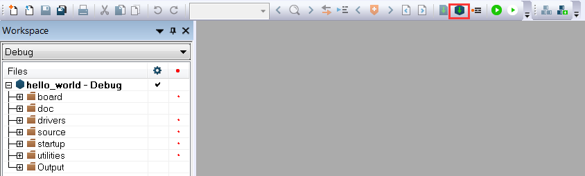

# Build an example application

Perform the following steps to build the `hello_world` example application.

1.  Open the desired demo application workspace. Most example application workspace files can be located using the following path:

    ```
    <install_dir>/boards/<board_name>/<example_type>/<application_name>/iar
    ```

    Using the TWR-KM35Z75M hardware platform as an example, the `hello_world` workspace is located in:

    ```
    <install_dir>/boards/twrkm35z75m/demo_apps/hello_world/iar/hello_world.eww
    ```

2.  Select the desired build target from the drop-down menu. For this example, select the **hello\_world – debug** target.

    |

|

3.  To build the demo application, click the **Make** button highlighted in red below.

    |

|

4.  The build completes without errors.

**Parent topic:**[Run a demo application using IAR](../topics/run_a_demo_application_using_iar.md)

