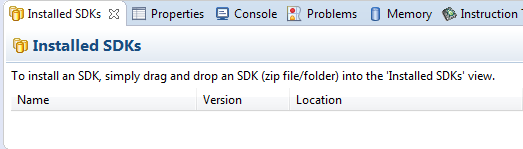
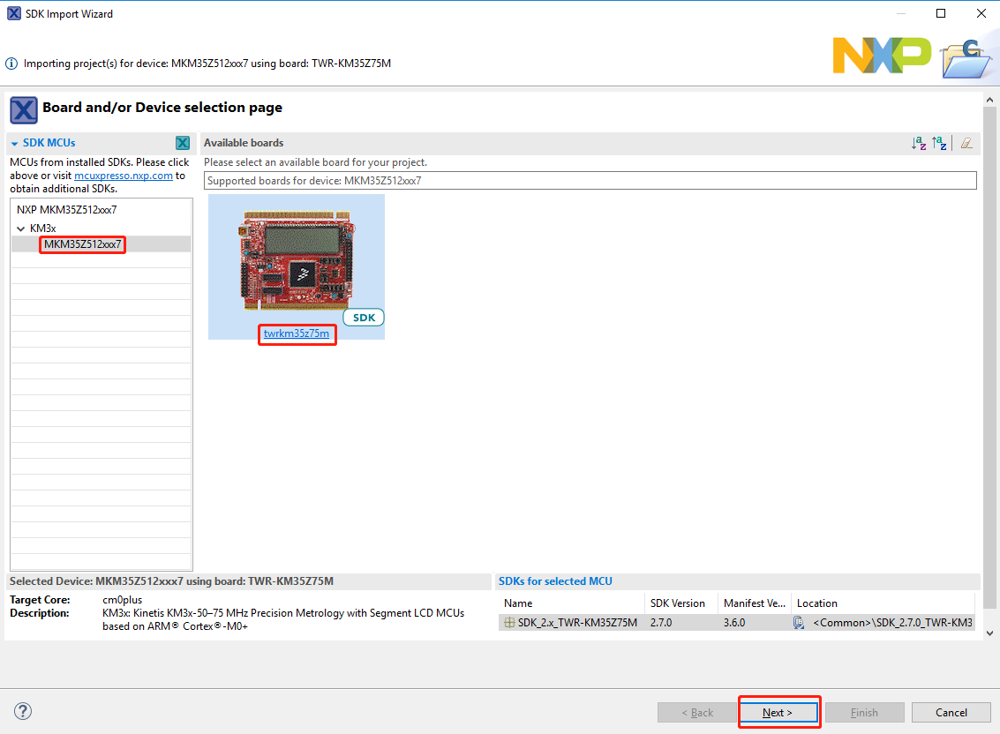
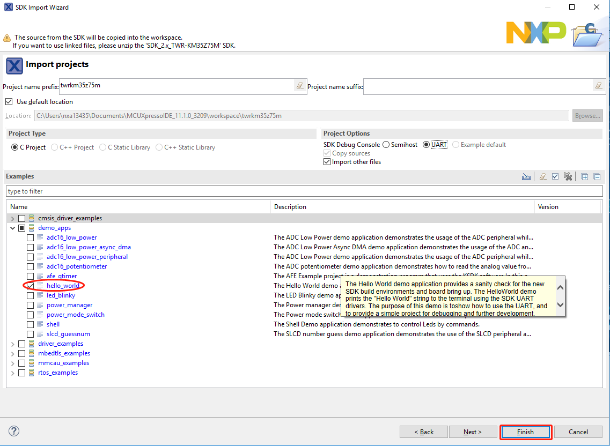

# Build an example application

To build an example application, follow these steps.

1.  Drag and drop the SDK zip file into the **Installed SDKs** view to install an SDK. In the window that appears, click **OK** and wait until the import has finished.

    |

|

2.  On the **Quickstart Panel**, click **Import SDK example\(s\)…**.

    |

|

3.  In the window that appears, expand the **KM3x** folder and select **MKM35Z512xxx7**. Then, select **twrkm35z75m** and click **Next**.

    |

|

4.  Expand the **demo\_apps** folder and select **hello\_world**. Then, click **Next**.

    |

|

5.  Ensure the option of `Redlib: Use floating point version of printf` is selected if the cases' print floating-point numbers are on the terminal for demo applications such as `adc_dma` and `adc_interrupt`. Otherwise, it is not necessary to select this option. Then, click **Finish**.

    |

|

**Parent topic:**[Run a demo using MCUXpresso IDE](../topics/run_a_demo_using_mcuxpresso_ide.md)

