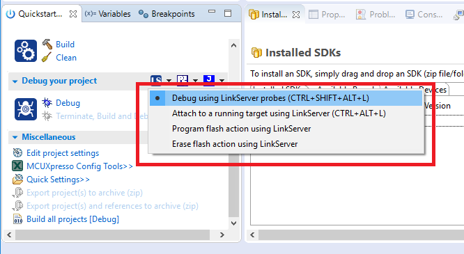
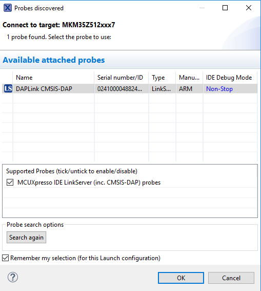

# Run an example application

For more information on debug probe support in the MCUXpresso IDE 11.1.1, visit [community.nxp.com](https://community.nxp.com/message/630901).

To download and run the application, perform these steps:

1.  Reference the table in Appendix B to determine the debug interface that comes loaded on your specific hardware platform.
    -   For boards with a P&E Micro interface, visit [www.pemicro.com/support/downloads\_find.cfm](www.pemicro.com/support/downloads_find.cfm) and download and install the P&E Micro Hardware Interface Drivers package.
    -   If using J-Link with either a standalone debug pod or OpenSDA, install the J-Link software \(drivers and utilities\) from [www.segger.com/jlink-software.html](www.segger.com/jlink-software.html).
2.  Connect the development platform to your PC via USB cable.
3.  Open the terminal application on the PC, such as PuTTY or TeraTerm, and connect to the debug serial port number \(to determine the COM port number, see Appendix A\). Configure the terminal with these settings:

    1.  115200 or 9600 baud rate, depending on your board \(reference `BOARD_DEBUG_UART_BAUDRATE` variable in the `board.h` file\)
    2.  No parity
    3.  8 data bits
    4.  1 stop bit
    | configurations")

|

4.  On the **Quickstart Panel**, click **Debug 'twrkm35z75m\_demo\_apps\_hello\_world’ \[Debug\]**.

    |

|

5.  The first time you debug a project, the **Debug Emulator Selection** dialog is displayed, showing all supported probes that are attached to your computer.

    Select the probe through which you want to debug and click **OK**. \(For any future debug sessions, the stored probe selection is automatically used, unless the probe cannot be found.\)

    |

|

6.  The application is downloaded to the target and automatically runs to `main()`.

    | when running
											debugging")

|

7.  Start the application by clicking **Resume**.

    |

|

The `hello_world` application is now running and a banner is displayed on the terminal. If not, check your terminal settings and connections.

|

|

**Parent topic:**[Run a demo using MCUXpresso IDE](../topics/run_a_demo_using_mcuxpresso_ide.md)

