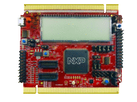

.. _twrkm35z75m:

TWR-KM35Z75M
####################

Overview
********

The TWR-KM35Z75M board is designed to work either in standalone mode or as part of the Tower System, a modular development board platform that enables rapid prototyping and tool re-use through reconfigurable hardware. Begin constructing your Tower System evaluation board platform today by visiting NXP.com/Tower for additional Tower System boards and compatible peripherals.

MCU device and part on board is shown below:

 - Device: MKM35Z7
 - PartNumber: MKM35Z512VLQ7

Getting Started with MCUXpresso SDK Package
*******************************************
.. toctree::
   :maxdepth: 1

   gettingStarted/gsindex.md

Getting Started with MCUXpresso SDK Github
*******************************************
.. toctree::
   :maxdepth: 1

   ../../../gsd/repo.rst

Release Notes
*******************************************
.. toctree::
   :maxdepth: 1

   releaseNotes/rnindex.md
