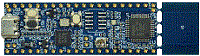

.. _lpc845breakout:

LPC845BREAKOUT
####################

Overview
********

The LPC845 breakout board provides a powerful and flexible development system for NXP's low end Cortex-M0+-based LPC84x Family of MCUs, delivered in an ultra-low-cost evaluation board. This breakout board can be used with a range of development tools, including the MCUXpresso IDE toolchain. The LPCXpresso845 Breakout board is developed by NXP to enable evaluation of and prototyping with the LPC84x family of MCUs. The LPC845 breakout board features an on-board CMSIS-DAP debug and VCOM port, RGB user LEDs, capacitive touch button, user potentiometer and allows an easy prototyping experience with access to 38 LPC845 port pins.

MCU device and part on board is shown below:

 - Device: LPC845
 - PartNumber: LPC845M301JBD48

Getting Started
****************
.. toctree::
   :maxdepth: 1
   :caption: Getting Started with MCUXpresso SDK for LPC845BREAKOUT

   ../../commongs/gettingStarted/gsindex.md

Release Notes
****************
.. toctree::
   :maxdepth: 1
   :caption: MCUXpresso SDK Release Notes for LPC845BREAKOUT

   releaseNotes/rnindex.md
