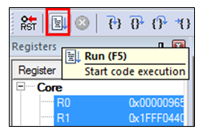

# Run an example application

To download and run the application, perform these steps:

1.  Download and install LPCScrypt or the Windows® operating systems driver for LPCXpresso boards from [www.nxp.com/lpcutilities](http://www.nxp.com/lpcutilities). This installs the required drivers for the board.
2.  Connect the development platform to your PC via USB cable between the Link2 USB connector and the PC USB connector. If you are connecting for the first time, allow about 30 seconds for the devices to enumerate.
3.  Open the terminal application on the PC, such as PuTTY or TeraTerm, and connect to the debug serial port number \(to determine the COM port number, see Appendix A\). Configure the terminal with these settings:

    1.  115200 baud rate \(reference BOARD\_DEBUG\_UART\_BAUDRATE variable in board.h file\)
    2.  No parity
    3.  8 data bits
    4.  1 stop bit
     configurations")

4.  To debug the application, click the “Start/Stop Debug Session” button, highlighted in red.

     when run debugging")

5.  Run the code by clicking the “Run” button to start the application.

    

    The hello\_world application is now running and a banner is displayed on the terminal. If this is not true, check your terminal settings and connections.

    

**Parent topic:**[Run a demo using Keil® MDK/μVision](../topics/run_a_demo_using_keil__mdk_vision.md)

