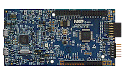

.. _lpcxpresso51u68:

LPCXpresso51U68
####################

Overview
********

The LPCXpresso family of boards provides a powerful and flexible development system for NXP's Cortex-M MCUs. The LPCXpresso51U68 board has been developed by NXP to enable evaluation of and prototyping with the LPC51U68 family of MCUs and its low power features make it as easy as possible to get started with your project. LPCXpresso is a low-cost development platform available from NXP supporting NXP's ARM-based microcontrollers. The platform is comprised of a simplified Eclipse-based IDE and low-cost target boards which include an attached JTAG debugger. LPCXpresso is an end-to-end solution enabling embedded engineers to develop their applications from initial evaluation to final production.

MCU device and part on board is shown below:

 - Device: LPC51U68
 - PartNumber: LPC51U68JBD64

Getting Started with MCUXpresso SDK Package
*******************************************
.. toctree::
   :maxdepth: 1

   gettingStarted/gsindex.md

Getting Started with MCUXpresso SDK Github
*******************************************
.. toctree::
   :maxdepth: 1

   ../../../gsd/repo.rst

Release Notes
*******************************************
.. toctree::
   :maxdepth: 1

   releaseNotes/rnindex.md
