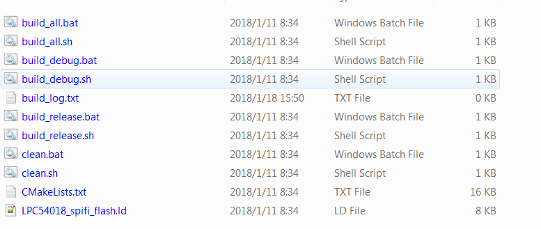
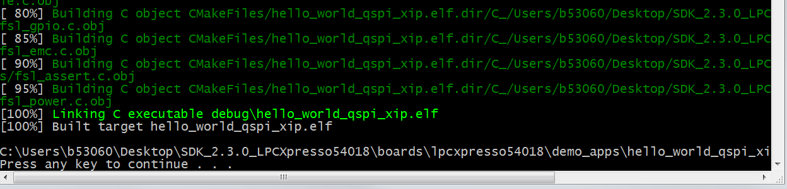

# Build an XIP example application

1.  Following the same steps as *Section 5.3, "Run an non-xip \(plain load\) example application"*, type “build\_debug.bat” on the command line or double click the "build\_debug.bat" file in Windows Explorer to perform the build.

    

2.  The build output is shown in this figure:

    

**Parent topic:**[Run a demo using Arm® GCC](../topics/run_a_demo_using_arm__gcc.md)

