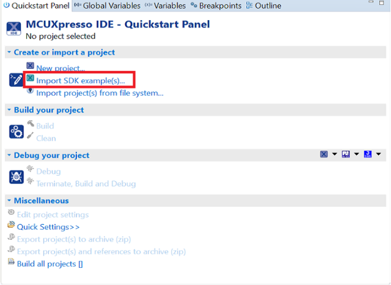
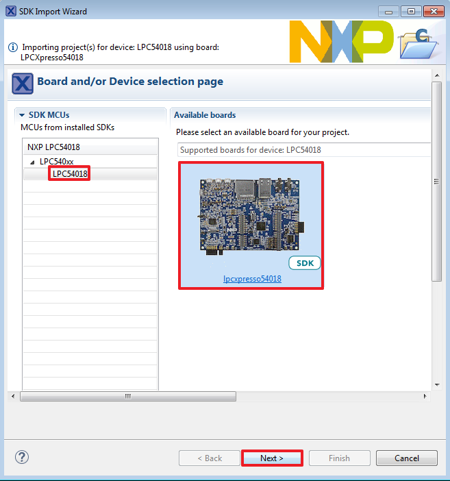
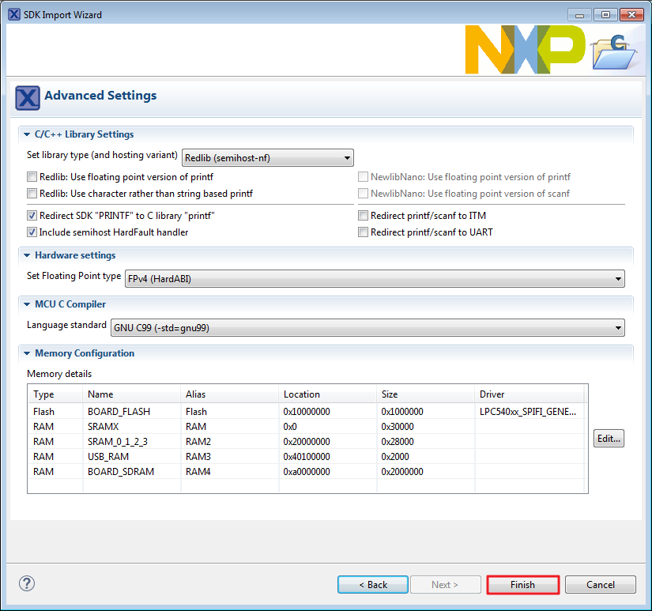

# Build an XIP example application

To build an example application, follow these steps.

1.  Drag and drop the SDK zip file into the "Installed SDKs" view to install an SDK. In the window that appears, click the "OK" button and wait until the import has finished.

    

2.  On the Quickstart Panel, click "Import SDK example\(s\)...".

    

3.  In the window that appears, expand the “LPC540xx folder and select “LPC54018". Then, select “lpcxpresso54018” and click the “Next” button.

    

4.  Expand the “demo\_apps” folder and select “hello\_world\_qspi\_xip”. Then, click the "Next” button.

    

5.  Ensure the option “Redlib: Use floating point version of printf” is selected if the cases print floating point numbers on the terminal \(for demo applications such as adc\_basic, adc\_burst, adc\_dma, and adc\_interrupt\). Otherwise, there is no need to select it. Click the “Finish” button.

    

**Parent topic:**[Run a demo using MCUXpresso IDE](../topics/run_a_demo_using_mcuxpresso_ide.md)

