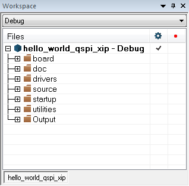
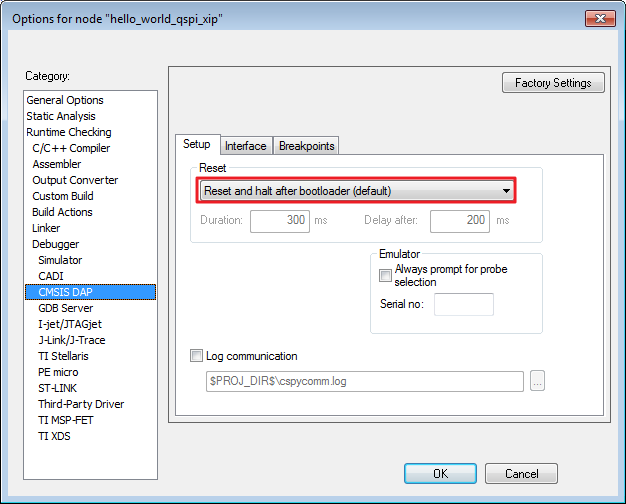
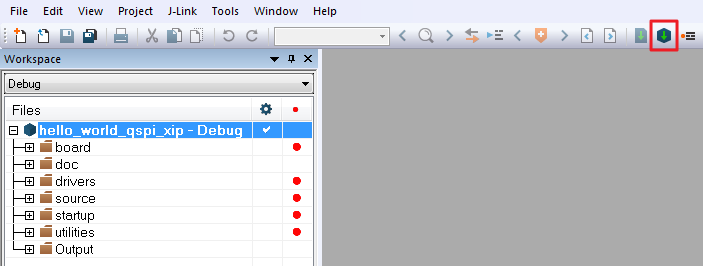

# Build an XIP example application

The following steps guide you through opening the hello\_world\_qspi\_xip example application. These steps may change slightly for other example applications, as some of these applications may have additional layers of folders in their paths.

1.  If not already done, open the desired demo application workspace. Most example application workspace files can be located using the following path:

    *<install\_dir\>/boards/<board\_name\>/<example\_type\>/<application\_name\>/iar*

    Using the LPCXpresso54018 hardware platform as an example, the hello\_world workspace is located in

    *<install\_dir\>/boards/lpcxpresso54018/demo\_apps/hello\_world/iar/hello\_world\_qspi\_xip.eww*

2.  Select the desired build target from the drop-down. For this example, select the “hello\_world\_qspi\_xip – Debug” target.

    

3.  Select "Reset and halt after bootloader", highlighted in red below.

    

4.  To build the demo application, click the “Make” button, highlighted in red below.

    

**Parent topic:**[Run a demo application using IAR](../topics/run_a_demo_application_using_iar.md)

