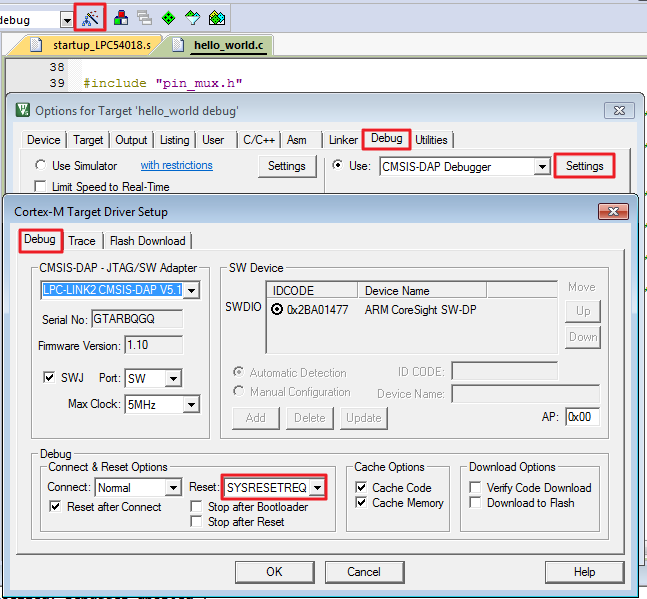
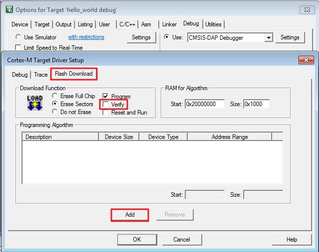
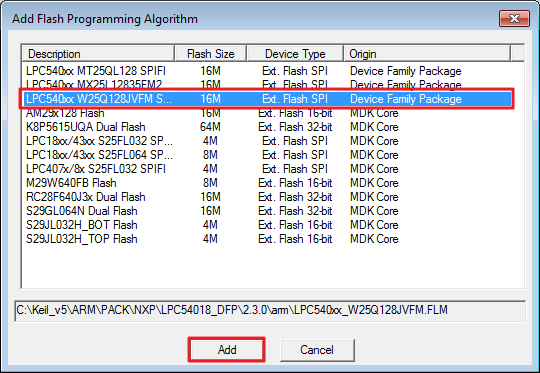
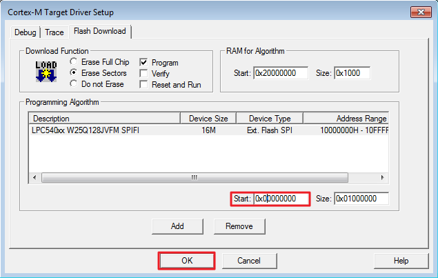
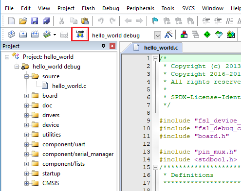

# How to program the non-XIP \(plain load\) example application to external flash

1.  Click the configure target option button and select the “SYSRESETREQ” reset option.

    

2.  Select the “Flash Download” option and click the “Add” button.

    

3.  Select the “LPC540xx W25Q128JVFM SPIF” option. For the LPCXpresso54018 board, select "LPC540xx MX25L12835FM2I" for the LPC54018-IoT-Module. Then, click the “Add” button.

    

4.  Set 0x00000000 as the start address and click the “OK” button.

    

5.  Click the “LOAD” button.

    **Note:** If 'LOAD' fails, press the SW4 button on the board, then repower the board or reset the board \(get into ISP mode\). Keep pressing SW4 when clicking the 'LOAD' button again to program the application into the external flash.

    

6.  Press the reset button on the board to run the example.

    The hello\_world application is now running and a banner is displayed on the terminal. If this is not true, check your terminal settings and connections.

    

**Parent topic:**[Run a demo using Keil® MDK/μVision](../topics/run_a_demo_using_keil__mdk_vision.md)

