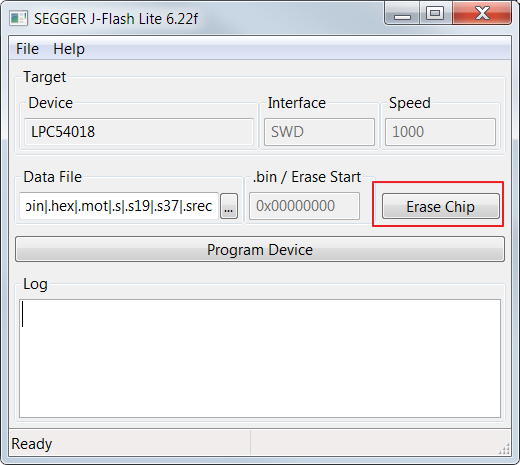
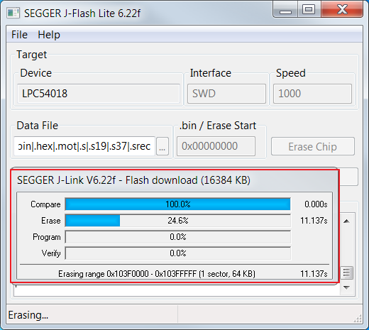
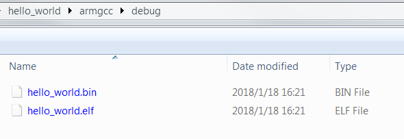
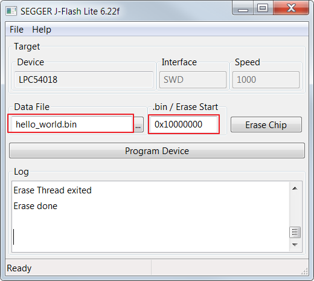
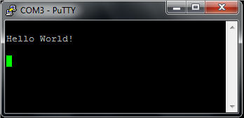

# How to program the non-XIP \(plain load\) example bin file to external flash

**External flash**

1.  Use the J-FLASH-Lite \(version high thatnV6.22\) to erase the chip.

    

2.  Wait for the flash erase finish.

    

    **Note:** If you cannot erase, press the SW4 button then press the reset button to enter ISP mode. Then, click the "Erase" button again \(keep pressing the SW4 button all the time\).

3.  Click ‘Program Device’ to program the binary file into external flash.

    

    

    **Note:** Make sure the ‘.bin/Erase Start’ address is 0x10000000 \(external flash base address\).

4.  After programming, press the reset button on the board to run.

    

**Parent topic:**[Run a demo using Arm® GCC](../topics/run_a_demo_using_arm__gcc.md)

