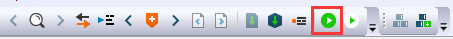

# Run an XIP example application

1.  In IAR, click the "Download and Debug" button to download the application to the target.

    

2.  The application is then downloaded to the target and automatically runs to the main\(\) function.

     when running debugging")

3.  Run the code by clicking the "Go" button to start the application.

    

4.  The hello\_world\_qspi\_xip application is now running and a banner is displayed on the terminal. If this is not true, check your terminal settings and connections.

    

**Parent topic:**[Run a demo application using IAR](../topics/run_a_demo_application_using_iar.md)

