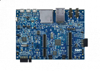

.. _lpcxpresso54s018m:

LPCXpresso54S018M
####################

Overview
********

The LPCXpresso54S018M board provides a powerful and flexible platform for easy evaluation of the LPC54600 family of microcontrollers. This board is an LPCXpresso V3 style, the latest generation of the original and highly successful LPCXpresso board family. These boards provide Arduino UNO compatible shield connectors with additional expansion ports around the Arduino footprint and also a PMod/host interface port. These boards feature an on-board LPC-Link2 debug probe based on the LPC4322 MCU for a performance debug experience over high speed USB, with easy firmware update options to support CMSIS-DSP or a special version of J-link OBD from SEGGER. The board can also be used with an external debug probe such as those from SEGGER and P&E.

The LPC54S00 series is fully supported by NXPs MCUXpresso suite of free software and tools, which include an Eclipse-based IDE, configuration tools and extensive SDK drivers/examples available at https://mcuxpresso.nxp.com. MCUXpresso SDK includes project files for use with IDEs from lead partners Keil and IAR, and these IDEs are also fully supported by the MCUXpresso pin, clock and peripheral configuration tools.

The LPCXpresso54S018M board includes an extensive set of connectors and on-board peripherals to enable full evaluation of the target MCU and development of highly functional prototypes. The on-board peripherals are complemented by a set of drivers and examples in the MCUXpresso SDK.

MCU device and part on board is shown below:

 - Device: LPC54S018M
 - PartNumber: LPC54S018J4MET180

Getting Started
****************
.. toctree::
   :maxdepth: 1
   :caption: Getting Started with MCUXpresso SDK for LPCXpresso54S018M

   gettingStarted/gsindex.md
