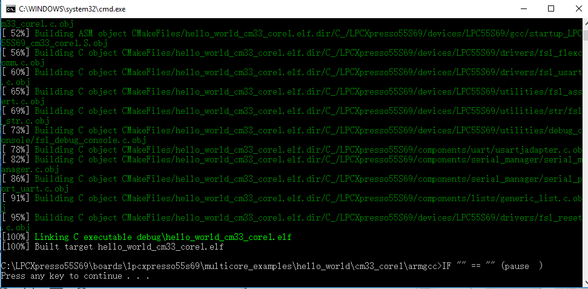
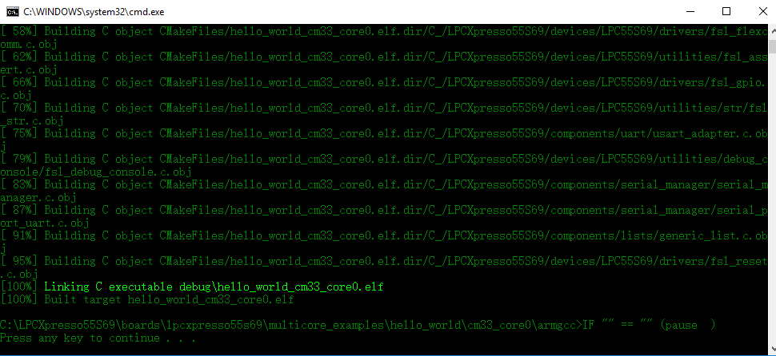

# Build a multicore example application {#GUID-656BD924-8EA3-4AD1-AE8B-27F586450B5B}

This section describes the steps to build and run a dual-core application. The demo application build scripts are located in this folder:

```
<install_dir>/boards/<board_name>/multicore_examples/<application_name>/<core_type>/armgcc
```

Begin with a simple dual-core version of the Hello World application. The multicore Hello World GCC build scripts are located in this folder:

```
<install_dir>/boards/lpcxpresso55s69/multicore_examples/hello_world/cm33_core0/armgcc/build_debug.bat
```

```
<install_dir>/boards/lpcxpresso55s69/multicore_examples/hello_world/cm33_core1/armgcc/build_debug.bat
```

Build both applications separately following steps for single core examples as described in [Build an example application](build_an_example_application_003.md#).

|

|

|

|

**Parent topic:**[Run a demo using Arm GCC](../topics/run_a_demo_using_arm__gcc.md)

