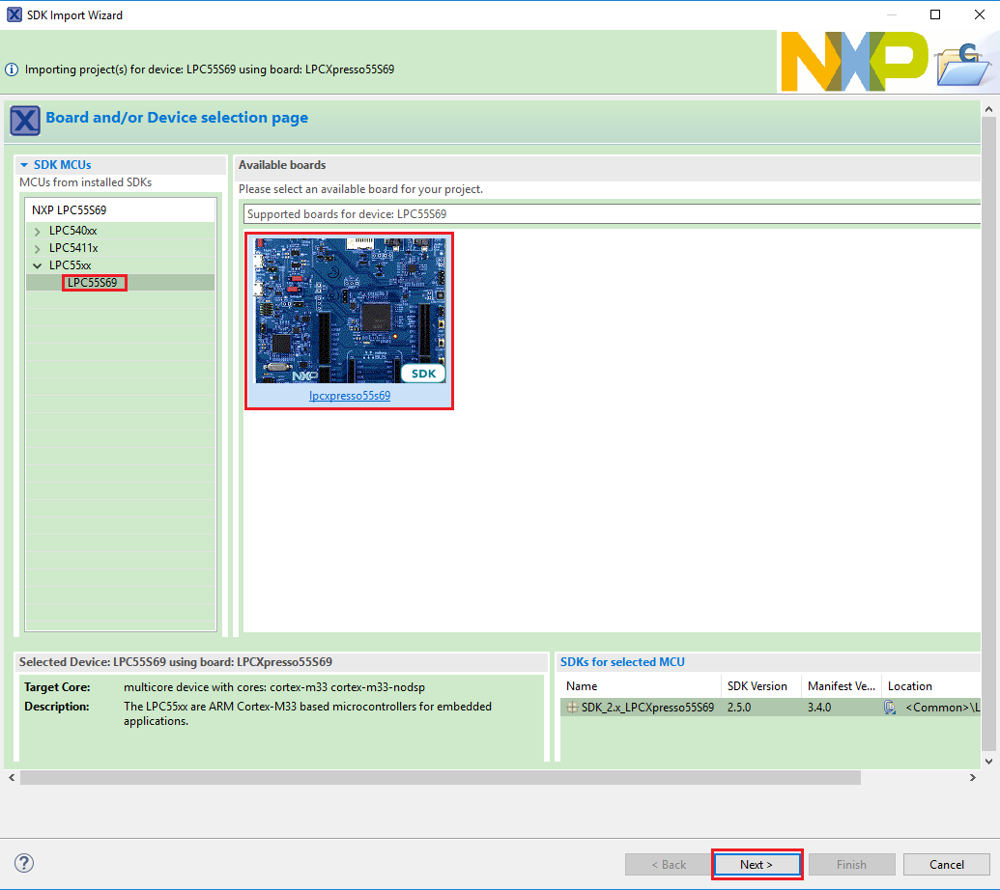
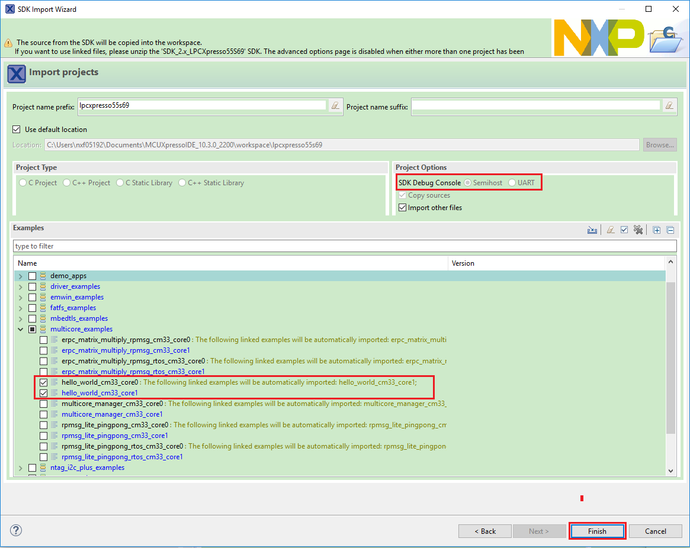

# Build a multicore example application {#GUID-8AD8895E-9A3C-4204-B8D9-BC7E80A08168}

This section describes the steps required to configure MCUXpresso IDE to build, run, and debug multicore example applications. The following steps can be applied to any multicore example application in the MCUXpresso SDK. Here, the dual-core version of hello\_world example application targeted for the LPCXpresso55S69 hardware platform is used as an example.

1.  Multicore examples are imported into the workspace in a similar way as single core applications, explained in [Build an example application](build_an_example_application.md#). When the SDK zip package for LPCXpresso55S69 is installed and available in the **Installed SDKs** view, click **Import SDK example\(s\)…** on the Quickstart Panel. In the window that appears, expand the **LPC55xx** folder and select **LPC55S69**. Then, select **lpcxpresso55s69** and click **Next**.

    |

|

2.  Expand the `multicore_examples` folder and select **hello\_world\_cm33\_core0**. The `core1` counterpart project is automatically imported with the `core0` project, because the multicore examples are linked together and there is no need to select it explicitly. Then select **UART** as SDK Debug Console. Click **Finish**.

    |

|

3.  Now, two projects should be imported into the workspace. To start building the multicore application, highlight the `lpcxpresso55s69_hello_world_cm33_core0` project \(multicore master project\) in the Project Explorer. Then choose the appropriate build target, **Debug** or **Release**, by clicking the downward facing arrow next to the hammer icon, as shown in [Figure 3](build_a_multicore_example_application_002.md#TERMINALSSPUTTY). For this example, select **Debug**.

    |

|

The project starts building after the build target is selected. Because of the project reference settings in multicore projects, triggering the build of the primary core application \(`core0`\) also causes the referenced auxiliary core application \(`core1`\) to build.

**Note:** When the **Release** build is requested, it is necessary to change the build configuration of both the primary and auxiliary core application projects first. To do this, select both projects in the Project Explorer view and then right click which displays the context-sensitive menu. Select **Build Configurations** -\> **Set Active** -\> **Release**. This alternate navigation using the menu item is **Project** -\> **Build Configuration** -\> **Set Active** -\> **Release**. After switching to the **Release** build configuration, the build of the multicore example can be started by triggering the primary core application \(`core0`\) build.

|

|

**Parent topic:**[Run a demo using MCUXpresso IDE](../topics/run_a_demo_using_mcuxpresso_ide.md)

