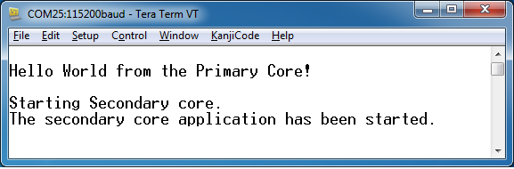

# Run a multicore example application {#GUID-51281C05-9932-44FE-936F-10DAAFFE3974}

The primary core debugger handles flashing both primary and the auxiliary core applications into the SoC flash memory. To download and run the multicore application, switch to the primary core application project and perform steps 1 – 4 as described in *[Run an example application](run_an_example_application_002.md#)*. These steps are common for both single core and dual-core applications in IAR.

After clicking the “Download and Debug" button, the auxiliary core project is opened in the separate EWARM instance. Both the primary and auxiliary images are loaded into the device flash memory and the primary core application is executed. It stops at the default C language entry point in the *main\(\) function*.

Run both cores by clicking the "Start all cores" button to start the multicore application.

|

|

During the primary core code execution, the auxiliary core is released from the reset. The hello\_world multicore application is now running and a banner is displayed on the terminal. If this does not appear, check the terminal settings and connections.

|

|

An LED controlled by the auxiliary core starts flashing, indicating that the auxiliary core has been released from the reset and is running correctly. When both cores are running, use the "Stop all cores", and "Start all cores" control buttons to stop or run both cores simultaneously.

|

|

**Parent topic:**[Run a demo application using IAR](../topics/run_a_demo_application_using_iar.md)

