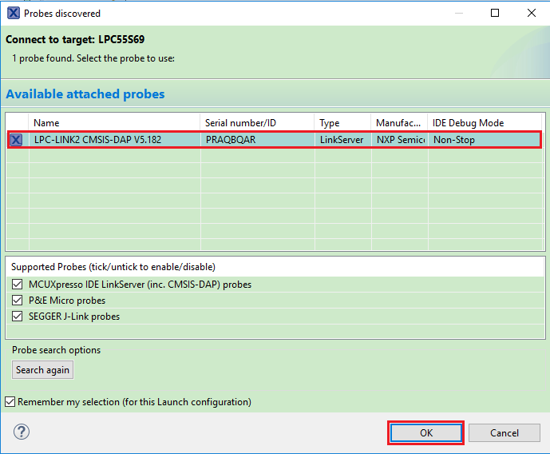
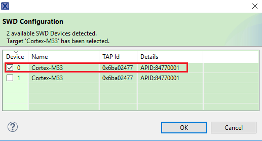
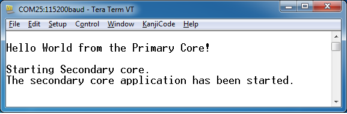
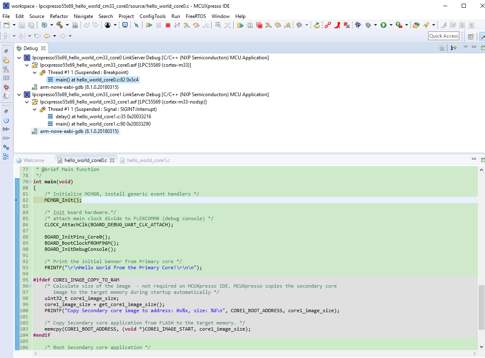

# Run a multicore example application {#GUID-B589418A-3736-4AE3-9271-09EA2E0CDBAD}

The primary core debugger handles flashing of both the primary and the auxiliary core applications into the SoC flash memory. To download and run the multicore application, switch to the primary core application project and perform all steps as described in *[Run an example application](run_an_example_application.md#)*. These steps are common for both single-core applications and the primary side of dual-core applications, ensuring both sides of the multicore application are properly loaded and started. However, there is one additional dialogue that is specific to multicore examples which requires selecting the target core. See the following figures as reference.

|

|

|

|

|

|

| when running
										debugging")

|

After clicking the "Resume All Debug sessions" button, the hello\_world multicore application runs and a banner is displayed on the terminal. If not, check your terminal settings and connections.

|

|

An LED controlled by the auxiliary core starts flashing, indicating that the auxiliary core has been released from the reset and running correctly. It is also possible to debug both sides of the multicore application in parallel. After creating the debug session for the primary core, perform same steps also for the auxiliary core application. Highlight the lpcxpresso55s69\_multicore\_examples\_hello\_world\_cm33\_core1 project \(multicore slave project\) in the Project Explorer. On the Quickstart Panel, click “Debug ‘lpcxpresso55s69\_multicore\_examples\_hello\_world\_cm33\_core1’ \[Debug\]” to launch the second debug session.

|

|

|

|

Now, the two debug sessions should be opened, and the debug controls can be used for both debug sessions depending on the debug session selection. Keep the primary core debug session selected by clicking the "Resume" button. The hello\_world multicore application then starts running. The primary core application starts the auxiliary core application during runtime, and the auxiliary core application stops at the beginning of the main\(\) function. The debug session of the auxiliary core application is highlighted. After clicking the “Resume” button, it is applied to the auxiliary core debug session. Therefore, the auxiliary core application continues its execution.

|

|

At this point, it is possible to suspend and resume individual cores independently. It is also possible to make synchronous suspension and resumption of both the cores. This is done either by selecting both opened debug sessions \(multiple selections\) and clicking the “Suspend” / "Resume” control button, or just using the “Suspend All Debug sessions” and the “Resume All Debug sessions” buttons.

|

|

|

|

**Parent topic:**[Run a demo using MCUXpresso IDE](../topics/run_a_demo_using_mcuxpresso_ide.md)

