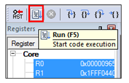
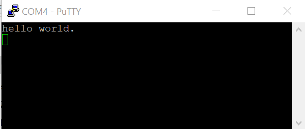

# Run an example application {#GUID-B4CDD55E-3A4B-4121-BE6F-BE8492E9669F}

To download and run the application, perform these steps:

1.  See the table in [Default debug interfaces](default_debug_interfaces.md#) to determine the debug interface that comes loaded on your specific hardware platform.

    -   For boards with the CMSIS-DAP/mbed/DAPLink interface, visit [mbed Windows serial configuration](https://developer.mbed.org/handbook/Windows-serial-configuration) and follow the instructions to install the Windows operating system serial driver. If running on Linux OS, this step is not required.
    -   For boards with a P&E Micro interface, visit [www.pemicro.com/support/downloads\_find.cfm](http://www.pemicro.com/support/downloads_find.cfm) and download and install the P&E Micro Hardware Interface Drivers package.
    -   If using J-Link either a standalone debug pod or OpenSDA, install the J-Link software \(drivers and utilities\) from [www.segger.com/jlink-software.html](www.segger.com/jlink-software.html).
    -   If using J-Link either a standalone debug pod or J-link firmware programmed into the onboard debug probe, install the J-Link software \(drivers and utilities\) from [www.segger.com/jlink-software.html](www.segger.com/jlink-software.html).
    -   For boards with the OSJTAG interface, install the driver from [www.keil.com/download/docs/408](http://www.keil.com/download/docs/408.asp).
2.  Connect the development platform to your PC via USB cable using OpenSDA USB connector.
3.  Open the terminal application on the PC, such as PuTTY or TeraTerm and connect to the debug serial port number \(to determine the COM port number, see [How to determine COM port](how_to_determine_com_port.md#)\). Configure the terminal with these settings:

    1.  115200 or 9600 baud rate, depending on your board \(reference `BOARD_DEBUG_UART_BAUDRATE` variable in the `board.h` file\)
    2.  No parity
    3.  8 data bits
    4.  1 stop bit
    | configurations")

|

4.  In μVision, after the application is built, click the **Download** button to download the application to the target.

5.  After clicking the **Download** button, the application downloads to the target and is running. To debug the application, click the **Start/Stop Debug Session** button, highlighted in red.

    | when run
												debugging")

|

6.  Run the code by clicking the **Run** button to start the application.

    |

|

    The `hello_world` application is now running and a banner is displayed on the terminal. If this does not appear, check your terminal settings and connections.

    |

|

**Note:** Must use J-Link v6.56a or higher version in Keil. When using J-Link on Keil, if the device is blank \(flash is erased\), first uncomment the line16 in the example/mdk/JLinkSettings.JLinkScript to release the function void ResetTarget\(void\)\{\}. Then do the download or debug, comment the function void ResetTarget\(void\)\{\} again.

**Parent topic:**[Run a demo using Keil MDK/μVision](../topics/run_a_demo_using_keil__mdk_vision.md)

