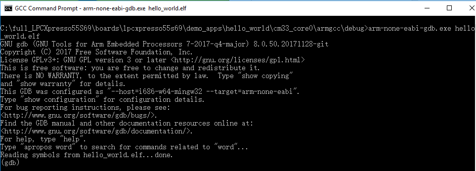

# Run an example application {#GUID-DA777921-70BD-4832-BDBB-0C0B2BB0B7A4}

This section describes steps to run a demo application using J-Link GDB Server application. To update the onboard LPC-Link2 debugger to Jlink firmware, see [Updating debugger firmware](updating_debugger_firmware.md).

**Note:** J-Link GDB Server application is not supported for TFM examples. Use CMSIS DAP instead of J-Link for flashing and debugging TFM examples.

After the J-Link interface is configured and connected, follow these steps to download and run the demo applications:

1.  Connect the development platform to your PC via USB cable between the LPC-Link2 USB connector and the PC USB connector. If using a standalone J-Link debug pod, connect it to the SWD/JTAG connector of the board.
2.  Open the terminal application on the PC, such as PuTTY or TeraTerm, and connect to the debug serial port number \(to determine the COM port number, see [How to determine COM port](how_to_determine_com_port.md#)\). Configure the terminal with these settings:

    1.  115200 or 9600 baud rate, depending on your board \(reference `BOARD_DEBUG_UART_BAUDRATE` variable in `board.h` file\)
    2.  No parity
    3.  8 data bits
    4.  1 stop bit

        | configurations")

|

    **Note:** Make sure that the board is set to FlexSPI flash boot mode \(ISP2: ISP1: ISP0 = ON, OFF, ON\) before use GDB debug.

3.  Open the J-Link GDB Server application. Assuming the J-Link software is installed, the application can be launched by going to the Windows operating system Start menu and selecting **Programs** -\> **SEGGER** -\> **J-Link <version\> J-Link GDB Server**.
4.  After it is connected, the screen should look like this figure:

    |

|

5.  If not already running, open a GCC Arm Embedded tool chain command window. To launch the window, from the Windows operating system Start menu, go to **Programs** -\> **GNU Tools Arm Embedded <version\>** and select **GCC Command Prompt**.

    |

|

6.  Change to the directory that contains the example application output. The output can be found in using one of these paths, depending on the build target selected:

    ```
    <install_dir>/boards/<board_name>/<example_type>/<application_name>/armgcc/debug
    ```

    ```
    <install_dir>/boards/<board_name>/<example_type>/<application_name>/armgcc/release
    ```

    For this example, the path is:

    ```
    <install_dir>/boards/lpcxpresso55s69/demo_apps/hello_world/armgcc/debug
    ```

7.  Run the `arm-none-eabi-gdb.exe <application_name>.elf` command. For this example, it is `arm-none-eabi-gdb.exe hello_world.elf`.

    |

|

8.  Run these commands:
    1.  `target remote localhost:2331`
    2.  `monitor reset`
    3.  `monitor halt`
    4.  `load`
9.  The application is now downloaded and halted at the watchpoint. Execute the `monitor go` command to start the demo application.

    The `hello_world` application is now running and a banner is displayed on the terminal. If this does not appear, check your terminal settings and connections.

    |

|


**Parent topic:**[Run a demo using Arm GCC](../topics/run_a_demo_using_arm__gcc.md)

