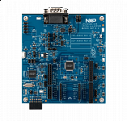

.. _lpcxpresso55s06:

LPCXpresso55S06
####################

Overview
********

The LPCXpresso55S06 development board provides the ideal platform for evaluation of and development with the LPC550x/S0x MCU based on the Arm Cortex-M33 architecture. The board includes a high-performance onboard debug probe and accelerometer, with several options for adding off-the-shelf add-on boards for networking, sensors, displays, and other interfaces.

The LPCXpresso55S06 is fully supported by the MCUXpresso suite of tools, which provides device drivers, middleware and examples to allow rapid development, plus configuration tools and an optional free IDE. MCUXpresso software is compatible with the open source MCU operating system FreeRTOS, tools from popular tool vendors such as Arm and IAR, and the LPCXpresso55S06 may also be used with the popular debug probes available from SEGGER and P&E Micro.

MCU device and part on board is shown below:

 - Device: LPC55S06
 - PartNumber: LPC55S06JBD64

Getting Started
****************
.. toctree::
   :maxdepth: 1
   :caption: Getting Started with MCUXpresso SDK for LPCXpresso55S06

   gettingStarted/gsindex.md
Release Notes
****************
:doc:`MCUXpresso SDK Release Notes for LPCXpresso55S06 <../../../release/index>`
