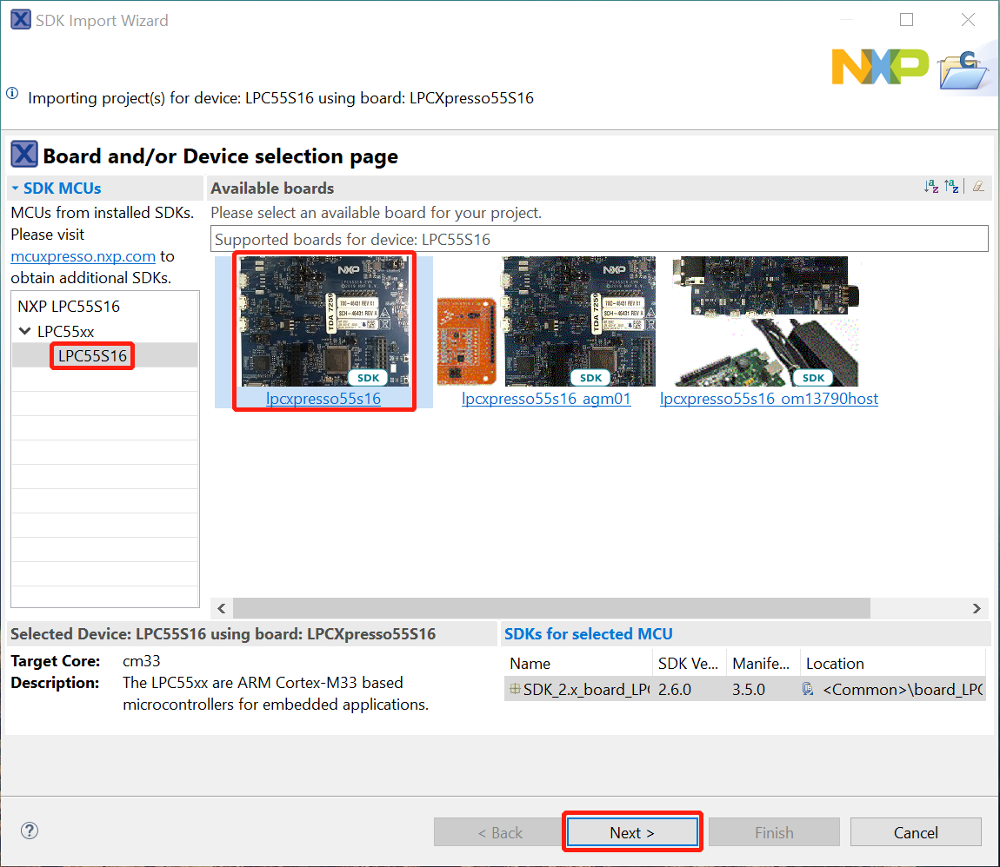
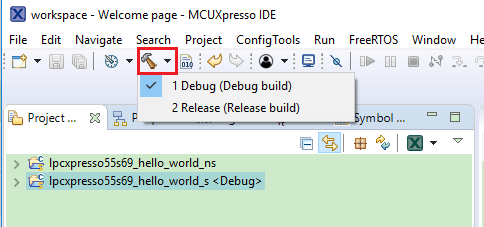
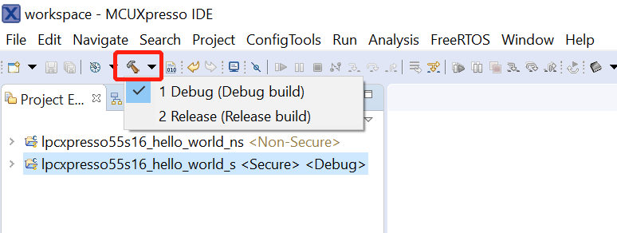

# Build a TrustZone example application

This section describes the steps required to configure MCUXpresso IDE to build, run, and debug TrustZone example applications. The trustzone version of the `hello_world` example application targeted for the LPCXpresso55S16 hardware platform is used as an example, though these steps can be applied to any TrustZone example application in the MCUXpresso SDK.

1.  TrustZone examples are imported into the workspace in a similar way as single core applications. When the SDK zip package for LPCXpresso55S16 is installed and available in the **Installed SDKs** view, click **Import SDK example\(s\)…** on the Quickstart Panel. In the window that appears, expand the **LPC55xx** folder and select **LPCXpresso55S16**. Then, select **LPCXpresso55S16** and click **Next**.

    

2.  Expand the `trustzone_examples/` folder and select `hello_world_s`. Because TrustZone examples are linked together, the non-secure project is automatically imported with the secure project, and there is no need to select it explicitly. Then select **UART** as SDK Debug Console. Then, click **Finish**.

    

3.  Now, two projects should be imported into the workspace. To start building the TrustZone application, highlight the `lpcxpresso55s16\_hello\_world\_s` project \(TrustZone master project\) in the Project Explorer. Then, choose the appropriate build target, **Debug** or **Release**, by clicking the downward facing arrow next to the hammer icon, as shown in [Figure 3](build_a_trustzone_example_application_003.md#SELECTFRDMK64FBOARD). For this example, select the **Debug** target.

    

    

    The project starts building after the build target is selected. It is requested to build the application for the secure project first, because the non-secure project needs to know the secure project since CMSE library when running the linker. It is not possible to finish the non-secure project linker when the secure project since CMSE library is not ready.

    **Note:** When the **Release** build is requested, it is necessary to change the build configuration of both the secure and non-secure application projects first. To do this, select both projects in the Project Explorer view by clicking to select the first project, then using shift-click or control-click to select the second project. Right click in the Project Explorer view to display the context-sensitive menu and select **Build Configurations** \> **Set Active** \>**Release**. This is also possible by using the menu item of **Project** \> **Build Configuration** \>**Set Active** \>**Release**. After switching to the **Release** build configuration. Build the application for the secure project first.

    

    

**Parent topic:**[Run a demo using MCUXpresso IDE](../topics/run_a_demo_using_mcuxpresso_ide.md)

