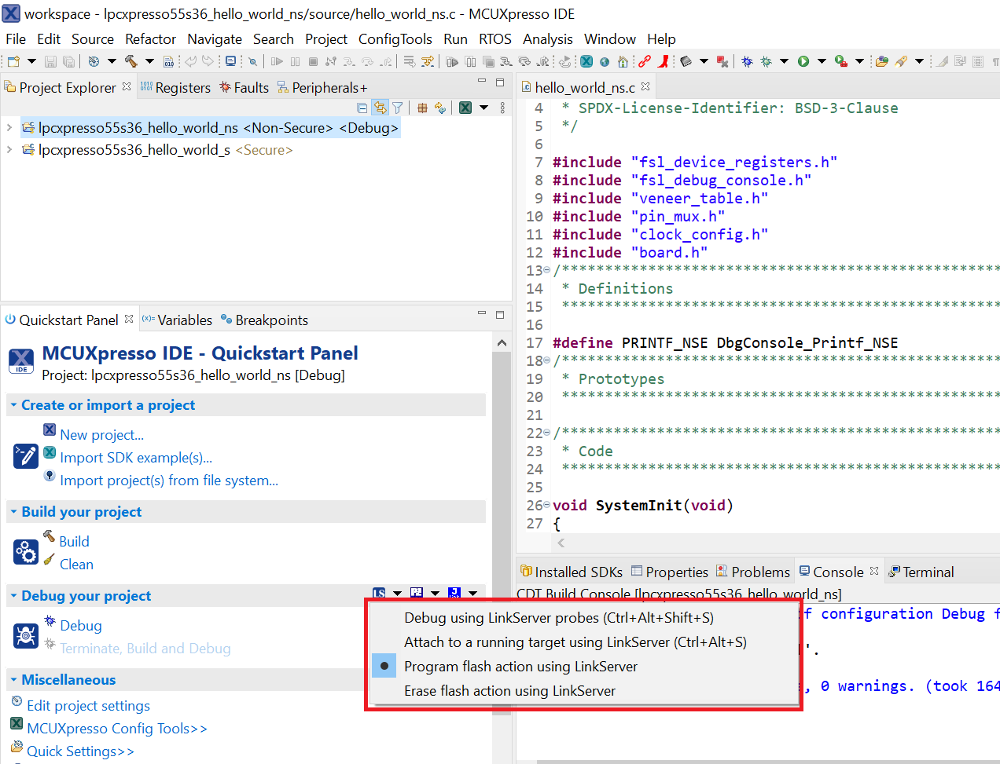
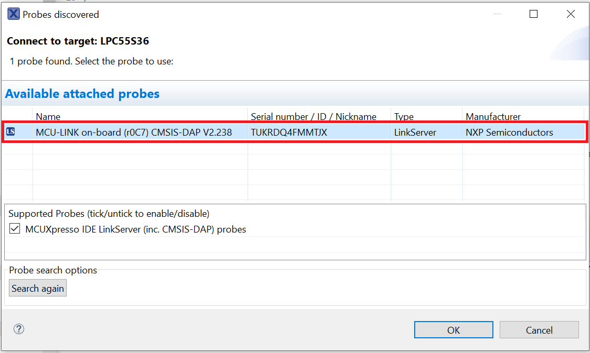
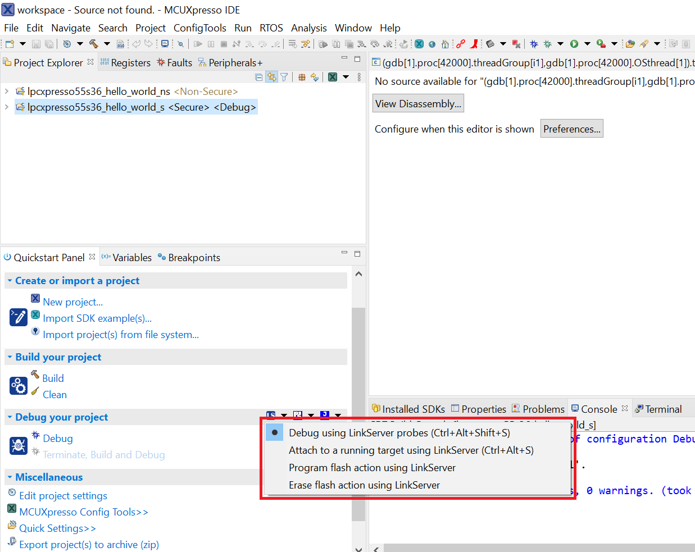
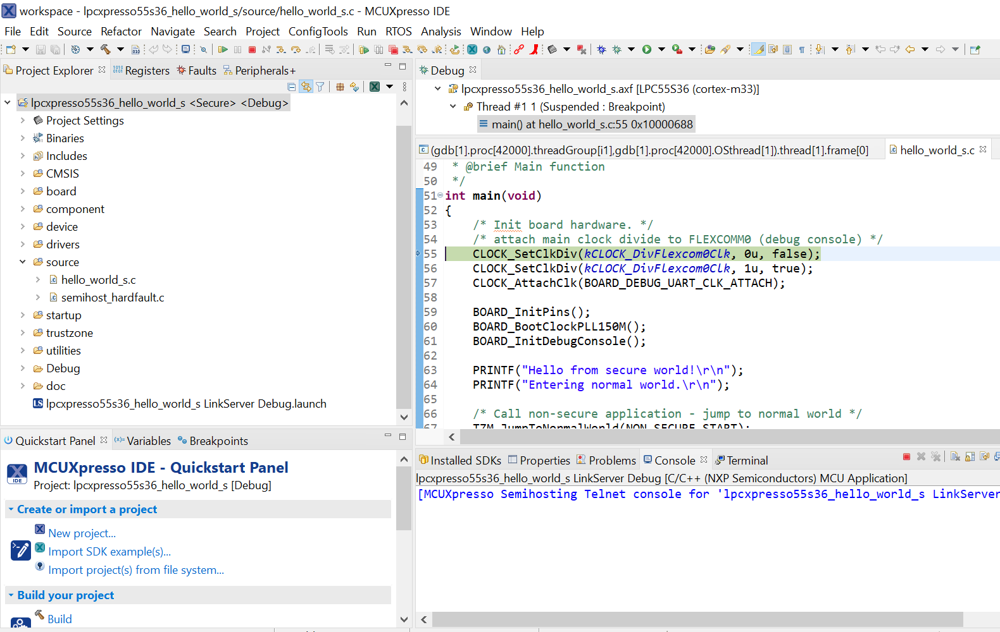
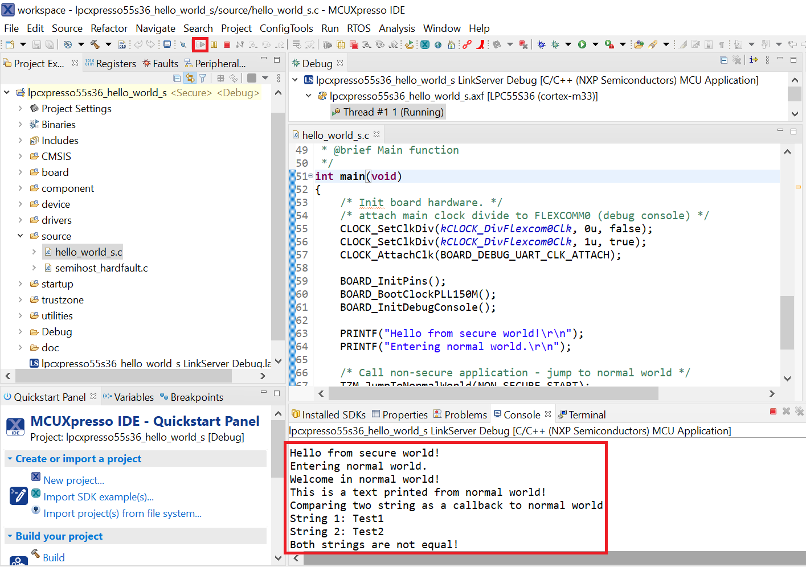

# Run a TrustZone example application

To download and run the application perform all steps as described in *Section 3.3, "Run an example application"*. These steps are common for single core, dual-core, and TrustZone applications, ensuring both sides of the TrustZone application are properly loaded and started secure application. However, there is one additional dialogue that is specific to TrustZone examples. See the following figures as reference.

|

|

|

|

After loading the non-secure application, press **RESET** on board to release the device connect. Then, highlight the `lpcxpresso55s36_trustzone_examples_hello_world_s` project \(TrustZone master project\) in the Project Explorer. In the Quickstart Panel, click **lpcxpresso55s36\_trustzone\_examples\_hello\_world\_s \[Debug\]** to launch the second debug session.

|

|

|

|

Start the application by clicking **Resume**. The `hello_world` TrustZone application then starts running, and the secure application starts the non-secure application during run time.

|

|

**Parent topic:**[Run a demo using MCUXpresso IDE](../topics/run_a_demo_using_mcuxpresso_ide.md)

