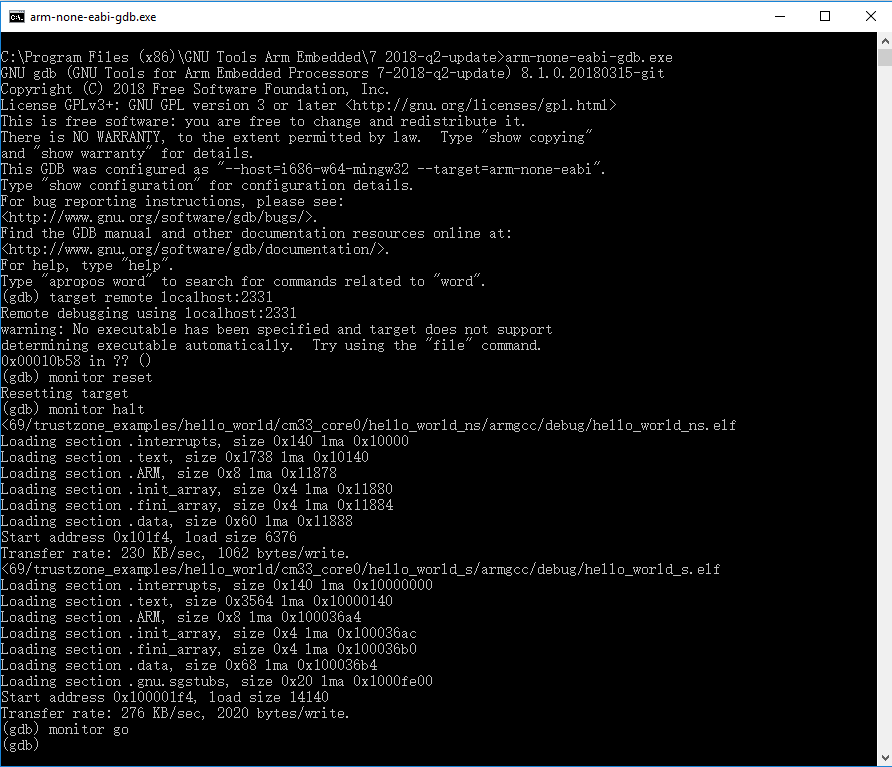

# Run a TrustZone example application

When running a TrustZone application, the same prerequisites for J-Link/J-Link OpenSDA firmware, and the serial console as for the single core application, apply, as described in *Section 6.3, "Run an example application”*.

To download and run the TrustZone application, perform steps 1 to 10, as described in *Section 5.3, "Run an example application"*. These steps are common for both single core and trustzone applications in Arm GCC.

Then, run these commands:

1.  `arm-none-eabi-gdb.exe`
2.  `target remote localhost:2331`
3.  `monitor reset`
4.  `monitor halt`
5.  `load <install\_dir\>/boards/lpcxpresso55s36/trustzone\_examples/hello\_world/cm33\_core0/hello\_world\_ns/armgcc/debug/hello\_world\_ns.elf`
6.  `load <install\_dir\>/boards/lpcxpresso55s36/trustzone\_examples/hello\_world/cm33\_core0/hello\_world\_s/armgcc/debug/hello\_world\_s.elf`
7.  The application is now downloaded and halted at the watch point. Execute the `monitor go` command to start the demo application.

|

|

|

|

**Parent topic:**[Run a demo using Arm® GCC](../topics/run_a_demo_using_arm__gcc.md)

